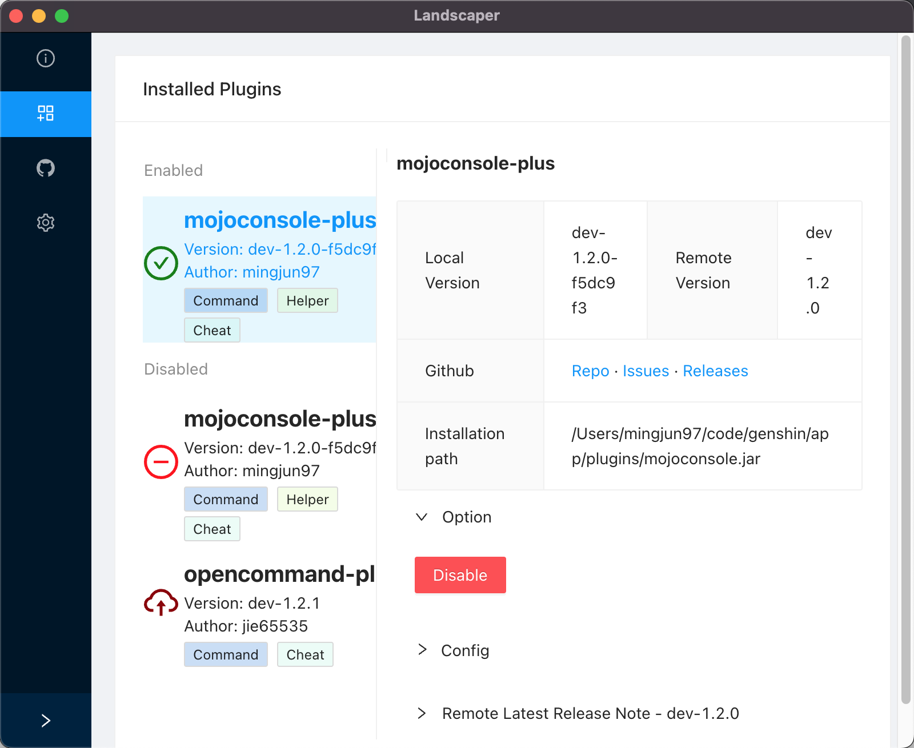
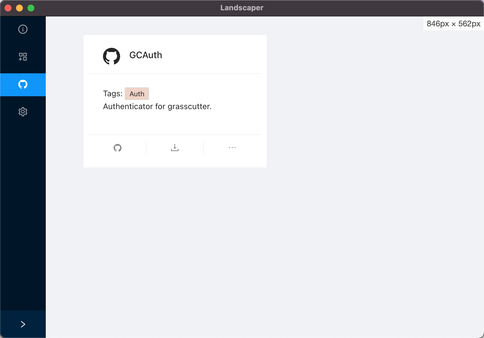

## Landscaper

### Screenshots/Features

* Works on all platform - Windows, Linux, MacOS

#### Grasscutter Manager

* Update check & One-click update


* Tooltip'd config editor


#### Grasscutter Plugin Manager



* Enable/Disable plugin
* Tooltip'd plugin config editor(For some plugins)
* Update check & One-click update
* **Plugin market** One-click install plugin



### Installation

##### Normal user

Install from github action build. You may use the following links to get the installer.

* [Windows](https://nightly.link/gc-mojoconsole/landscaper/workflows/build/electron/dist-windows-latest.zip)

* [MacOS](https://nightly.link/gc-mojoconsole/landscaper/workflows/build/electron/dist-macos-latest.zip)

* [Linux](https://nightly.link/gc-mojoconsole/landscaper/workflows/build/electron/dist-ubuntu-latest.zip)

##### Developer

```bash
# clone repo
git clone https://github.com/gc-mojoconsole/landscaper

# install dependencies
cd landscaper
npm install
npm install --prefix ./landscaper/

# run
npm start # should work on linux & mac os, not tested on windows yet, PR welcome
```


